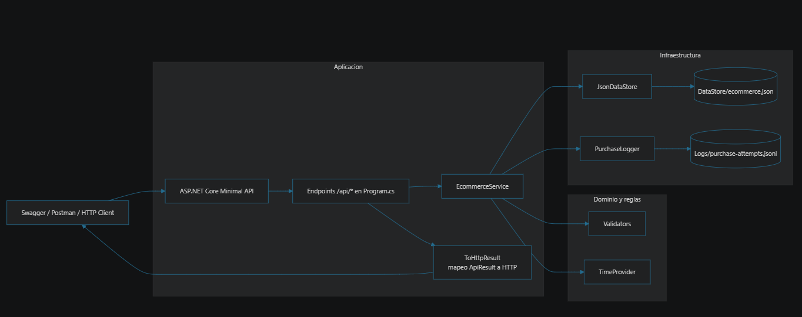

# AIChallenge E-commerce Backend

Backend local para un marketplace orientado a clientes mexicanos. Expone una API HTTP con Swagger, persistencia JSON local, simulación de autorización de compras, seguimiento de órdenes y logs de intentos de compra.

## Diagrama de arquitectura



## Funcionalidad

Sí hace:

- Registra clientes con nombre, CURP, fecha de nacimiento y domicilio.
- Valida duplicidad de cliente por CURP.
- Valida estructura de CURP y mayoría de edad.
- Valida correspondencia colonia / C.P. / municipio / estado con un catálogo local de Ciudad de México.
- Registra métodos de pago sin ejecutar cargos reales.
- Valida número de tarjeta con Luhn, tipo de tarjeta, expiración, CVV y duplicidad por cliente.
- Lista productos semilla con SKU, precio y características.
- Crea órdenes de compra con autorización simulada.
- Rechaza órdenes mayores a 5,000 MXN.
- Guarda intentos aceptados y rechazados en logs JSONL.
- Consulta orden por clave y lista órdenes por cliente.

No hace:

- No cobra tarjetas reales.
- No se conecta a pasarelas bancarias.
- No valida domicilios contra servicios oficiales externos.
- No incluye frontend.
- No despliega infraestructura cloud.

## Ejecución local

```powershell
dotnet restore
dotnet run --project AIChallenge\AIChallenge.csproj
```

Abrir Swagger en la URL indicada por la consola, normalmente `https://localhost:<puerto>/swagger` o `http://localhost:<puerto>/swagger`.

## Persistencia y modelos de datos

Los datos se guardan en `AIChallenge/DataStore/ecommerce.json` al iniciar o usar la API.

Modelos principales:

- `Customer`: clave, nombre completo, CURP, fecha de nacimiento, domicilio, fecha de creación.
- `PaymentMethod`: clave, clave de cliente, tarjeta enmascarada, huella SHA-256, tipo, titular, expiración.
- `Product`: SKU, nombre, precio, características.
- `PurchaseOrder`: clave, cliente, fecha, total, productos, código simulado, status, detalle.
- `PurchaseAttemptLog`: intento de compra con datos relevantes para auditoría.

## Endpoints

| Método | Ruta | Uso |
| --- | --- | --- |
| POST | `/api/customers` | Registrar cliente |
| POST | `/api/payment-methods` | Registrar método de pago |
| GET | `/api/products` | Listar productos |
| POST | `/api/orders` | Crear orden |
| GET | `/api/orders/{orderId}` | Consultar seguimiento de orden |
| GET | `/api/customers/{customerId}/orders` | Listar órdenes de un cliente |

## Flujo de procesos

### Registro de cliente

1. Recibe datos personales y domicilio.
2. Normaliza CURP.
3. Rechaza si CURP ya existe.
4. Rechaza si CURP no cumple estructura oficial básica.
5. Rechaza si el cliente es menor de 18 años.
6. Rechaza si el domicilio no existe en el catálogo local soportado.
7. Guarda cliente y regresa clave `CUS-*`.

### Registro de método de pago

1. Verifica que el cliente exista.
2. Valida Luhn del número de tarjeta.
3. Valida correspondencia con VISA, Mastercard o AMEX.
4. Valida expiración en formato `MM/yy` y no vencida.
5. Valida CVV de 3 dígitos, o 4 para AMEX.
6. Rechaza duplicados por huella de tarjeta y cliente.
7. Guarda solo tarjeta enmascarada y huella SHA-256.

### Creación de orden

1. Verifica cliente y método de pago.
2. Valida productos y cantidades.
3. Calcula total.
4. Rechaza si total supera 5,000 MXN.
5. Genera código simulado `SIM-*`.
6. Guarda orden aceptada o rechazada.
7. Registra intento en log JSONL.

### Seguimiento de orden

1. Consulta por clave `ORD-*`.
2. Regresa fecha, total, status y detalle.
3. Para aceptadas incluye tracking inicial: `Order accepted`, `Preparing shipment`.
4. Para rechazadas incluye motivo de rechazo.

## Códigos de error

| Código | Significado |
| --- | --- |
| `CUSTOMER_DUPLICATE` | CURP ya registrada |
| `CUSTOMER_CURP_INVALID` | Estructura de CURP inválida |
| `CUSTOMER_UNDER_AGE` | Cliente menor de edad |
| `ADDRESS_INVALID` | Domicilio fuera del catálogo soportado |
| `CUSTOMER_NOT_FOUND` | Cliente inexistente |
| `PAYMENT_DUPLICATE` | Método de pago duplicado |
| `PAYMENT_CARD_INVALID` | Número de tarjeta inválido |
| `PAYMENT_CARD_BRAND_MISMATCH` | Tipo de tarjeta no corresponde al número |
| `PAYMENT_EXPIRATION_INVALID` | Expiración inválida o vencida |
| `PAYMENT_CVV_INVALID` | CVV inválido |
| `PAYMENT_NOT_FOUND` | Método de pago inexistente para el cliente |
| `PRODUCT_NOT_FOUND` | Producto inexistente |
| `ORDER_QUANTITY_INVALID` | Cantidad inválida |
| `ORDER_LIMIT_EXCEEDED` | Total mayor a 5,000 MXN |
| `ORDER_NOT_FOUND` | Orden inexistente |

## Pruebas

Ejecutar pruebas unitarias:

```powershell
dotnet test
```

Validación de cobertura sugerida:

```powershell
dotnet test --collect:"XPlat Code Coverage"
```

Las pruebas cubren reglas de mayoría de edad, CURP, tarjetas, duplicidad, límite de orden y registro de intentos rechazados.

## Logs y troubleshooting

Los intentos de compra se registran en `AIChallenge/Logs/purchase-attempts.jsonl`, un JSON por línea.

Campos relevantes:

- `id`
- `timestamp`
- `customerId`
- `paymentMethodId`
- `total`
- `productSkus`
- `accepted`
- `authorizationCode`
- `rejectionReason`

Troubleshooting común:

- Si Swagger no abre, revisar el puerto mostrado por `dotnet run`.
- Si no aparecen productos, borrar `AIChallenge/DataStore/ecommerce.json` para regenerar semilla.
- Si una dirección se rechaza, usar una combinación soportada del catálogo documentado.
- Si una tarjeta se rechaza, usar números de prueba válidos por Luhn y marca.

## Catálogo local de domicilios soportados

| C.P. | Colonia | Municipio | Estado |
| --- | --- | --- | --- |
| 06100 | Hipódromo | Cuauhtémoc | Ciudad de México |
| 06700 | Roma Norte | Cuauhtémoc | Ciudad de México |
| 03100 | Del Valle Centro | Benito Juárez | Ciudad de México |
| 11000 | Lomas de Chapultepec | Miguel Hidalgo | Ciudad de México |

## Demo funcional sugerida

1. `GET /api/products` para ver SKUs disponibles.
2. `POST /api/customers` con un cliente mayor de edad y dirección soportada.
3. `POST /api/payment-methods` con tarjeta de prueba válida.
4. `POST /api/orders` con productos cuyo total sea menor o igual a 5,000 MXN.
5. `GET /api/orders/{orderId}` para consultar status y tracking.
6. Repetir `POST /api/orders` con total mayor a 5,000 MXN para demostrar rechazo y log.
