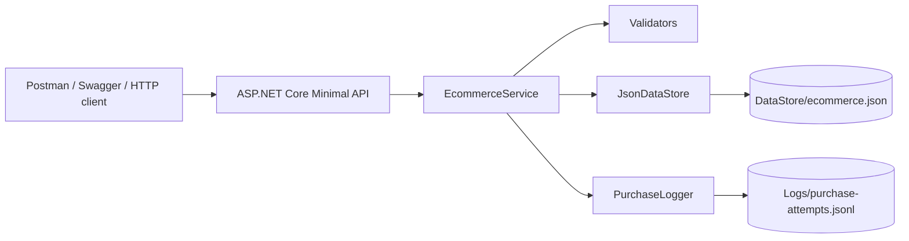

# Diagrama de arquitectura

## Componentes

- **ASP.NET Core Minimal API**: publica endpoints locales y documentación Swagger.
- **EcommerceService**: concentra casos de uso y reglas de negocio.
- **Validators**: valida CURP, edad, domicilio, tarjeta, expiración y CVV.
- **JsonDataStore**: lee y escribe datos locales en JSON.
- **PurchaseLogger**: registra todos los intentos de compra en JSONL y `ILogger`.

## Decisiones técnicas

- Persistencia JSON local por simplicidad y portabilidad.
- Tarjetas sin cargos reales; solo se conserva número enmascarado y huella SHA-256.
- Catálogo local de direcciones limitado a Ciudad de México, suficiente para la regla de un estado.
- Swagger habilitado siempre para facilitar demo local.
